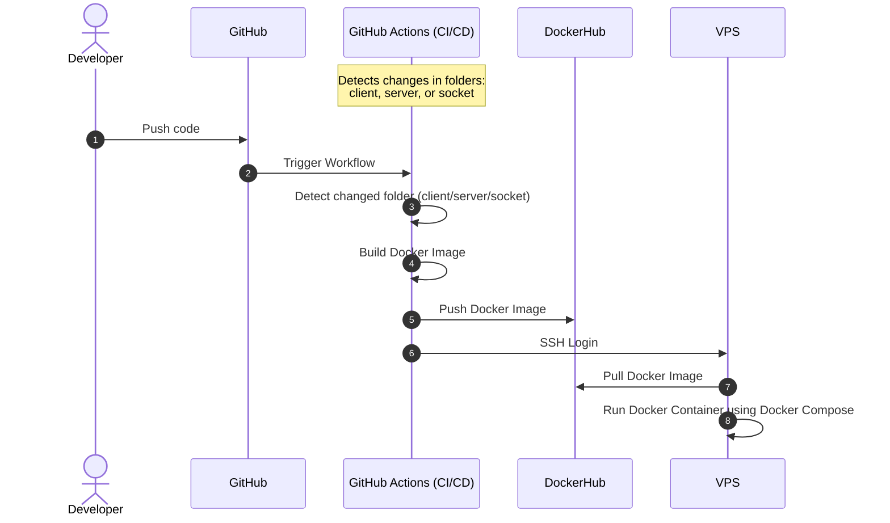

<h1 align="center">
  Globemart (AI-Powered Global Ecommerce Platform)
</h1>

## Contents
- [Project Overview](#project-overview)
- [Video Demo](#video-demo)
- [Tech Stack](#tech-stack)
- [Project Architecture](#project-architecture)
- [Key Features](#key-features)
- [Performance Optimizations](#performance-optimizations)
- [Challenges Faced](#challenges-faced)
- [Future Enhancements](#future-enhancements)

## Project Overview
### 1) What's the project about?
- **Globemart** is a production-level **AI-powered global e-commerce platform** built using the **MERN** stack. It enables users worldwide to shop seamlessly with advanced features like

  - AI Customer Support Agent (built using RAG pipeline)
  - AI-Powered Voice Product Search
  - Geospatial Nearby Stores (Proximity Service)
  - Real-time low-latency Customer Support Chat
  - Dynamic currency conversion based on customer location
  - Secure payments
  - Automated coupon management using cron jobs.

- The platform also includes a powerful **Admin Dashboard** for **sales analytics** and managing users, inventory, orders, reviews, chats, and coupons, and it is deployed using **Docker** with a **CI/CD** pipeline on a VPS for automated production deployment.

### 2) There are many other e-commerce platforms, so why did you build it? What's the differentiating factor, and what problem does it solve?
- I built Globemart to solve practical limitations commonly found in traditional e-commerce applications while also gaining end-to-end product development experience.

- Most e-commerce platforms provide basic search and customer support systems, but they often lack intelligent assistance, voice-based shopping, and offline store integration when products go out of stock. To address these gaps, I implemented:

  - **AI Customer Support Agent** to instantly handle common user queries using intent understanding, reducing dependency on human support for repetitive questions.
  - **AI Product Voice Search** that allows users to search naturally using voice commands like “Show me wedding kurtas between ₹2000 and ₹5000”, making product discovery faster and more user-friendly.
  - **Nearby Stores (Proximity Service)** to help users find nearby offline stores when products are out of stock online, improving customer satisfaction and trust.

- Apart from solving these problems, I built this project to deeply understand the complete **SDLC** of a real-world product — from planning and development to deployment, scalability, and DevOps. This project taught me **Product Ownership** and helped me develop a **strong product-thinking mindset** and understand how large-scale applications are built and maintained end-to-end.

## Video Demo
- Timestamps are attached in the video description: https://www.youtube.com/watch?v=cuLdY5N6rpA

## Tech Stack

### 🚀 Frontend 
- **JavaScript**
- **React.js** – core app
- **Tailwind CSS** – styling
- **Redux Toolkit** – global state management
- **RTK Query** – API data fetching
- **Framer Motion** – UI animations
- **Leaflet.js** – maps and geolocation features
- **Recharts** – analytics and dashboard charts

### 🚀 Backend
- **Node.js**
- **Express.js**
- **JWT** - authentication & authorization
- **Socket.io** – real-time chat functionality
- **Cloudinary** – image storage and optimization
- **Nodemailer** – email notifications
- **Node Cache** - caching
- **Node Schedule** – background job scheduling (automatic coupon expiry)
- **Winston** – centralized logging

### 🚀 Database
- **MongoDB** (MongoDB Atlas)

### 🚀 Payment Gateway
- **Stripe** – secure online payment processing
- **Cash on Delivery** - for offline payments

### 🚀 AI Integration 
- **LangChain.js** – building LLM-powered workflows
- **LangGraph.js** – RAG agent orchestration
- **gemini-embedding-2** – vector embeddings
- **gemini-3.1-flash-lite** – LLM for AI responses

### 🚀 Deployment (DevOps & Infrastructure) 
- **Docker** – containerization
- **Nginx** – reverse proxy and request handling
- **Hostinger VPS (KVM1)** – production hosting
- **Github Actions CI/CD Pipeline** – automated build and deployment

## Project Architecture
### Main Architecture

### AI Customer Support Agent Architecture

```mermaid
graph TD
    %% Start Node
    Start((Customer Query)) --> Sanitize[Sanitization & Pre-processing]
    Sanitize --> IntentNode{Intent Classification<br/><i>Gemini LLM</i>}

    %% Intent Branching
    IntentNode -- "general" --> GenHandler[General Chat Handler]
    IntentNode -- "policy" --> PolicyHandler[Policy RAG Handler]
    IntentNode -- "product_info" --> InfoHandler[Product Detail Handler]
    IntentNode -- "product_review_summary" --> ReviewHandler[Review Summarizer]
    IntentNode -- "unknown" --> UnknownHandler[Fallback Agent]

    %% General Flow
    GenHandler --> GenLLM[Gemma LLM: Contextual Response]
    GenLLM --> FinalOutput

    %% Policy RAG Flow
    PolicyHandler --> Embed[Generate Embeddings for customer query using<br/><i>Gemini Embedding-001</i>]
    Embed --> VectorSearch[Vector Search<br/><i>MongoDB Atlas</i>]
    VectorSearch --> PolicyCheck{Docs Found?}
    PolicyCheck -- "No" --> PolicyFail["I couldn't find specific information..."]
    PolicyCheck -- "Yes (Top 3)" --> PolicySum[Summarize Docs<br/><i>Gemma LLM</i>]
    PolicySum --> FinalOutput
    PolicyFail --> FinalOutput

    %% Product Info Flow
    InfoHandler --> InfoExtract[Extract Product Name using<br/><i>Gemma LLM</i>]
    InfoExtract --> InfoCheckName{Name Found?}
    InfoCheckName -- "No" --> InfoNoName["Please enter exact product name..."]
    InfoCheckName -- "Yes" --> InfoDB[Query MongoDB for product]
    InfoDB --> InfoCheckDB{In Database?}
    InfoCheckDB -- "No" --> InfoNoDB["Product not available..."]
    InfoCheckDB -- "Yes" --> InfoFilter[Filter & Format details using<br/><i>Gemma LLM</i>]
    InfoFilter --> FinalOutput
    InfoNoName --> FinalOutput
    InfoNoDB --> FinalOutput

    %% Updated Review Summary Flow
    ReviewHandler --> RevExtract[Extract Product Name using<br/><i>Gemma LLM</i>]
    RevExtract --> RevCheckName{Name Found?}
    RevCheckName -- "No" --> RevNoName["Please enter product name for reviews..."]
    
    RevCheckName -- "Yes" --> RevCheckDBExist{Product in DB?}
    
    RevCheckDBExist -- "No" --> RevNoProd["Sorry! Review summary for product you want is not available"]
    
    RevCheckDBExist -- "Yes" --> RevFetch[Fetch top 5 product reviews from DB]
    
    RevFetch --> RevCount{Reviews > 0?}
    RevCount -- "No" --> RevNone["No reviews found for this product..."]
    RevCount -- "Yes" --> RevSum[Summarize Reviews using<br/><i>Gemma LLM</i>]
    
    RevSum --> FinalOutput
    RevNoName --> FinalOutput
    RevNoProd --> FinalOutput
    RevNone --> FinalOutput

    %% Unknown Flow
    UnknownHandler --> UnknownMsg["Sorry, please switch to 'Chat with our Agent'"]
    UnknownMsg --> FinalOutput

    %% End Node
    FinalOutput((Response Sent to User))

    %% Styling
    style IntentNode fill:#b202b8,stroke:#333,stroke-width:2px
    style Start fill:#e35b5b
    style FinalOutput fill:#e35b5b
    style VectorSearch fill:#424242
    style InfoDB fill:#424242
    style RevFetch fill:#424242
```

### Deployment Architecture

## Key Features
- Engineered an end-to-end **AI-Powered Customer Support Agent** using **LangChain** and **LangGraph** to
build a **RAG pipeline** capable of **answering policy FAQs**, **retrieving product details**, and **summarizing
customer reviews**, reducing human intervention for routine queries.
- Implemented **AI-Powered Voice Product Search** using **Gemini** and **vector embeddings**, improving
search efficiency through semantic product search with price and category filtering.
- Developed a highly reliable **Real-Time Customer Support Chat** service using **Socket.io** with **typing
indicators**, **online presence**, **unread notifications**, **emoji support**, and **message read status** for
seamless customer-agent communication.
- Architected a scalable **Geospatial Nearby Stores** solution using **MongoDB geospatial indexes** and the
**Haversine** formula, displaying store locations on interactive **Leaflet maps** with route visualization and
distance calculations to help customers locate **out-of-stock** products.
- Integrated payment processing using **Stripe**, supporting online payments and **Cash on Delivery**, with
**automated invoice generation** and **order confirmation emails** via **Nodemailer**.
- Built a **Dynamic Currency Conversion System** supporting 165+ global currencies based on user
location, enabling users to shop and view product prices in their local currency.
- Developed and maintained an **Automated Coupon Lifecycle Management** using **node-schedule jobs** to
activate and expire coupons daily at midnight without manual intervention.
- Developed a scalable **Admin Dashboard** for enterprise application management with **sales analytics**,
**inventory**, **coupons**, **orders**, **real-time admin chat support**, and **customer review monitoring**.
- **Containerized** and deployed maintainable software services using **Docker**, **CI/CD pipeline**, and **Nginx** as
a reverse proxy on a **VPS** Infrastructure.
- Built complete e-commerce functionality including product catalog with filters, cart, wishlist, reviews, user
profiles, and an order tracking system.

## Performance Optimizations

### Frontend Optimizations
- **Lazy Loading & Code Splitting** – Implemented **React.lazy**, **Suspense**, and **dynamic imports** to load components on demand, significantly reducing initial bundle size and improving page load performance. 
- **Memoization** – Used **React.memo**, **useMemo**, and **useCallback** to prevent unnecessary component re-renders, improving rendering efficiency in complex UI components.
- **Debounced Search** – Implemented debouncing for product search and admin chat search to avoid triggering API requests on every keystroke, reducing unnecessary network calls.
- **Infinite Scrolling** – Implemented infinite scroll for wishlist and product lists so that data is fetched only when users reach the end of the list, improving performance and user experience.
- **API Caching with RTK Query** – Used RTK Query’s built-in caching to reuse previously fetched API responses, reducing redundant network requests and improving response time 
- **Image Optimization with Cloudinary CDN** – Served product images through Cloudinary CDN instead of the application server, reducing server load and improving image delivery latency globally.
- Put images of LCP, FCP scores

### Backend Optimizations
- **Server-side Caching** – Cached frequently requested data to minimize repeated database queries, reducing database load and improving API response latency.
- **Gzip Compression** – Enabled **gzip** compression for frontend bundles and backend API responses, reducing payload sizes and improving response time over the network.
- **Pagination for Large Datasets** – Implemented pagination to return only a limited number of products per request, reducing database load, bandwidth usage, and improving API performance   
- **Database Indexing** – Created indexes on high-frequency query fields such as **product title**, **user email**, and **username**, along with **geospatial indexing** for store locations, significantly improving query performance.
- **MongoDB Aggregation Pipelines** – Used aggregation pipelines for complex operations such as **sales analytics**, **multi-filter product queries**, and **vector search**, enabling efficient server-side data processing.  
- **Selective Data Projection** – Returned only required fields in API responses to reduce payload size and improve response latency. 
- **Upload Size Restrictions** – Implemented middleware to restrict image uploads to 8 MB, preventing large file uploads from degrading server performance 
- **Log Rotation in Docker** – Configured **Docker log rotation** to prevent Winston logs from filling disk space on the VPS, ensuring long-term server stability. 

### Security
- **Rate Limiting** – Implemented request rate limiting to protect APIs from **DDoS** attacks and **brute-force** attempts.
- **JWT Authentication with Token Blacklisting** – Implemented secure JWT authentication with **token blacklisting** to invalidate compromised or logged-out tokens.
- **Secure HTTP Headers** – Used the **helmet** middleware to add security headers such as **Content Security Policy** (CSP) to mitigate **XSS**, **MITM**, and **clickjacking** attacks.
- **NoSQL Injection Protection** – Integrated **mongo-sanitize** to prevent malicious query operators and protect against **NoSQL** injection attacks.
- **Password Security** – Stored user passwords securely using **bcrypt** hashing with salt
- **Infrastructure Firewall** – Configured VPS firewall and OS level **UFW** (Uncomplicated Firewall) to restrict server access to only necessary ports, reducing attack surface.

### Error Handling
- **Frontend Error Boundaries** – Implemented **react-error-boundary** at component, feature, and root levels to gracefully handle UI errors without crashing the entire application.  
- **Centralized Backend Error Handling** – Designed a global error-handling middleware in Express.js to standardize error responses and simplify debugging and logging.
  
## Challenges Faced
### 1) AI Customer Support Agent
**Challenge**: Building an **AI agent** that can handle multiple intents (policy questions like returns/refunds, product queries, review summaries) was difficult because a generic LLM does not have access to platform-specific data and often produces hallucinated or irrelevant responses.

**Solution**: 
- Implemented an intent-based routing system using **LangChain** and **LangGraph**, where each query is first classified using an **intent classifier**, and then routed to the appropriate tool for processing.
- Built a **RAG (Retrieval-Augmented Generation)** pipeline trained on my Globemart data (policies, products, reviews), ensuring the LLM generates context-aware and accurate responses instead of generic outputs.

### 2) Real-Time Customer Support Chat
**Challenge**: Implementing real-time chat was not just about sending messages, it required handling multiple real-time states, like:
- Online/Offline presence
- Typing indicators
- Unread message counts
- Message seen status
- Maintaining consistency across all these states with low latency was challenging.

**Solution**: I implemented an event-driven architecture using Socket.io, where separate events manage different chat states such as messages, typing indicators, seen status, and user presence. For each feature, I developed **reusable custom hooks** on the frontend to support both customer-side and admin-side chat functionality, while maintaining a clean, scalable codebase.

### 3) Nearby Stores (Proximity Service)
**Challenge**: Calculating the physical distance between a user and multiple stores in real-time for every store would be inefficient.

**Solution**: 
- I used **MongoDB geospatial indexing (2dsphere index)** and **$nearSphere** queries to fetch nearby stores based on user location and efficiently calculate distances using the **Haversine** formula
- This allows the database to perform optimized distance-based searches, ensuring fast and scalable retrieval of nearby stores.

### 4) Complex Authentication and Authorization
**Challenge**: Designing a secure authentication system required handling multiple concerns such as secure **login/signup**, **protecting private routes**, **preventing token reuse after logout**, and mitigating **brute-force** attacks. Additionally, ensuring a seamless user experience with token expiry and refresh without forcing users to re-login frequently was a key challenge.

**Solution**: 
- I implemented **JWT-based** authentication with **token blacklisting**, ensuring that invalidated tokens cannot be reused after logout.
- Added **role-based authorization (admin/user)** using middleware to protect sensitive routes.
- To enhance security, I implemented **rate limiting** on authentication endpoints to mitigate **brute-force** attacks.
- For a better user experience, I integrated **automatic token refresh** using **RTK Query interceptors**, which transparently refresh expired access tokens without interrupting user sessions.

### 5) Deployment
**Challenge**: Deploying my Globemart application in a production-like environment required solving:
- Environment consistency issues
- Manual deployment errors
- Scalability limitations
- Secure request routing
  
**Solution**: 
- I containerized the application using **Docker**, ensuring consistent environments across development and production.
- Set up **CI/CD** pipelines to automate build and deployment, eliminating manual errors.
- Used **Nginx** as a reverse proxy to route requests to appropriate containers and configured firewalls for security.
- This architecture also enables horizontal scaling by adding more containers in the future.

## Future Enhancements
### 1) Handling Race Conditions & Data Consistency
- I plan to handle race conditions in critical flows such as **product stock updates**, **coupon usage limits**, and **concurrent order placements**.
- This can be solved using **atomic** database operations, **transactions**, and **locking mechanisms** to ensure data consistency under high concurrency.

### 2) Asynchronous Processing with Message Queues
- Introduce message queues (**RabbitMQ**) to offload tasks like **sending emails**, **order processing**, and **notifications** from the main request cycle.
- This will improve API response time and ensure reliable background processing without blocking the **main thread**.

### 3) Monitoring & Observability
- Integrate **Prometheus** and **Grafana** to monitor system metrics such as **API latency**, **error rates**, and **resource utilization**.
- This will enable real-time insights, faster debugging, and proactive issue detection in production.

### 4) Scalable System Architecture
- **Vertical scaling** initially to handle moderate traffic growth
- **Horizontal scaling** of the monolithic application using **load balancing** for higher **concurrency**
- Gradual transition to **microservices** architecture if specific modules become performance bottlenecks
- This ensures the system evolves efficiently based on real-world traffic demands.

## Login Page

## SignUp Page

## Rate Limiting the Login Attempts

## Forgot Password Page

## Reset token sent to customer's Gmail

## Reset Password Page

## Home Page

## Benefits Section

## Featured Products Section

## All Products Page

## Search Products Page

## Search Products using voice (products for customer's voice query are below)

## Products requested by the customer through their voice

## Single Product Page

## Single Product Description Section

## Product Reviews Section

## Related Products Section

## Nearby Stores Page

## Customer's Wishlist Page

## Cart Page

## Order Page

## Payment Page

## Payment Successful Page

## Order Invoice sent to customer's Gmail (For online payment) 

## Order Invoice sent to customer's Gmail (For offline payment)

## Payment Failed Page

## Customer Orders Page

## Customer Profile Page

## Edit Profile Page

## Change Password Page

## Dynamic Currency Feature

## Admin Page (Dashboard)

## Inventory Management Page (Dashboard)

## Edit Inventory Page (Dashboard)

## Coupons Management Page (Dashboard)

## Create Coupon Page (Dashboard)

## Customer Orders Management Page (Dashboard) 

## Edit Customer's Order Page (Online Payment - Stripe) (Dashboard)

## Edit Customer's Order Page (Offline Payment - Cash on delivery) (Dashboard) 

## All Customers Management Page (Dashboard)

## Managing customer support assistance using chat (Dashboard)

## Chat between Customer and Customer support agent

## Product Reviews Management Page (Dashboard)

## 404 (Not Found) Page

